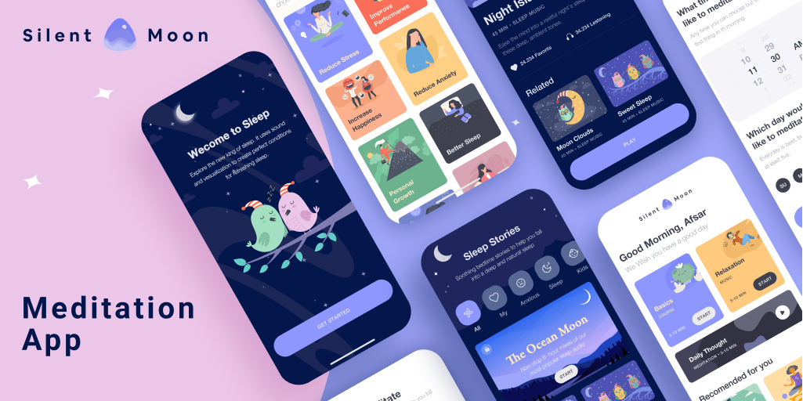
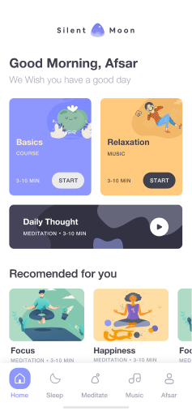
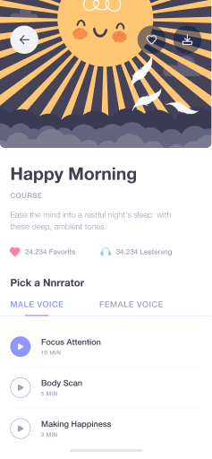
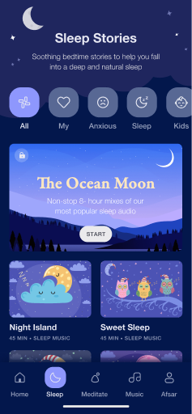
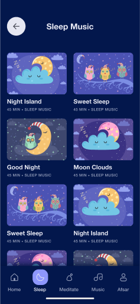
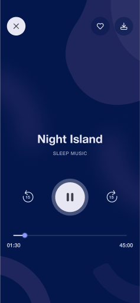

## Silent Moon ⌒
meditation app, Explore the app, Find some peace of mind to prepare for meditation.
using [Flutter](https://flutter.dev) and [MUSOPEN](https://musopen.org/) music services.

[](https://github.com/husen-hn/SilentMoon/releases/latest)

*ui designed by [Afsar](https://www.figma.com/community/file/882888114457713282)*

## Features ⌑
* Available in five languages. (English, German, Russian, Arabic, Persian).

## Previews ⛶

    

## Contribute ༜
Want to contribute? I would really appreciate a hand with the development to add more features in this app.
Feel free to Fork, edit, then pull!

## Feature roadmap ⌲
* [x] UI
* [ ] MVVM
* [ ] BloC
* [x] Accessibility
* [ ] Provider
* [ ] Dark Mode
* [ ] Animation
* [ ] Google Sign in
* [ ] Notification

<!-- ## Download ⇣
[](https://cafebazaar.ir/app/com.husen.android.bitgram) [](https://github.com/husen-hn/Bitgram/releases/latest) -->

## License ©
```
Copyright © 2021 Hossein HassanNejad 
Licensed under the GNU Version 3 license.
```